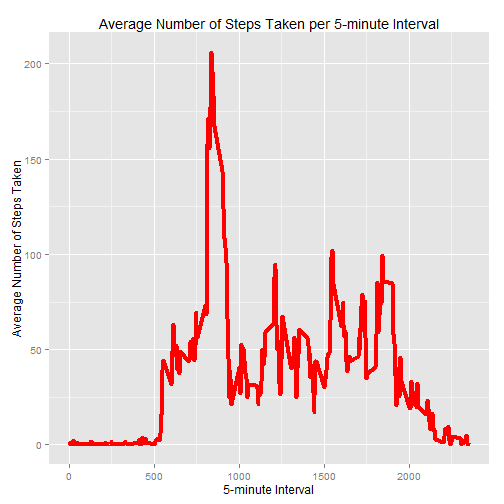
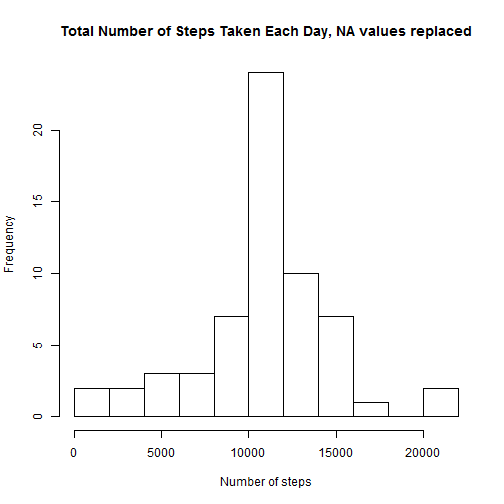

#Reproducible Research  
##Peer Assessment 1

Before beginning, ensure the plyr and ggplot2 packages are loaded. 

```r
library(plyr)
```

```
## Warning: package 'plyr' was built under R version 3.1.1
```

```r
library(ggplot2)
```

####1. Load and pre-process the data
Download the data from this site:   
[Activity Monitoring Data](https://d396qusza40orc.cloudfront.net/repdata%2Fdata%2Factivity.zip)  
Unzip the data and save the .csv in your working directory as "activity.csv"  
Set your working directory as necessary and appropriate, and read in "activity.csv" as a data frame.  

```r
setwd("C:/Users/ChappellFam/Documents/GitHub/C5_CP2/Reproducible-Research-Peer-Assessment-1")
data <- read.csv("activity.csv")
```

No processing or transformation is required at this step; it will be performed within commands in future steps. 


####2. What is mean total number of steps taken per day?
First, use ddply to compute the total number of steps taken each day. By passing the na.rm=TRUE parameter, we are allowing it to ignore NA values for now.  

```r
countdata <- ddply(data, c("date"), summarise, N = sum(steps, na.rm=TRUE))
```

Next, plot the histogram of total number of steps taken each day. For clarity, we have set the number of breaks to 9 (resulting in 10 bins).  

```r
hist(countdata$N, xlab="Number of steps", main="Total Number of Steps Taken Each Day, NA values ignored", breaks=9)
```

 

Finally, calculate and report the mean and median total number of steps taken per day (these are stored in the "countdata" variable generated above).  

```r
mean(countdata$N)
```

```
## [1] 9354
```

```r
median(countdata$N)
```

```
## [1] 10395
```


####3. What is the average daily activity pattern?
First, use ddply to take the mean number of steps within each 5-minute interval, averaged across all days.  

```r
avgint <- ddply(data, c("interval"), summarise, mean = mean(steps, na.rm=TRUE))
```

Next, use ggplot to make a time-series plot of the average steps per interval, as the day progresses.  We made the line red, just to be a bit more interesting.  

```r
p2 <- ggplot(data=avgint, aes(x=interval, y=mean, group =1)) + geom_line(colour="red", size=1.5)+xlab("5-minute Interval")+ylab("Average Number of Steps Taken")+ggtitle("Average Number of Steps Taken per 5-minute Interval")
p2
```

 

Last, determine the 5-minute interval, across all the days, which has the maximum mean number of steps. 

```r
MaxInt <- which.max(avgint$mean)
avgint$interval[MaxInt]
```

```
## [1] 835
```

####4. Imputing missing values
First, we will determine the locations and quantity of NA values within the steps data. whereNA is a logical vector indicating if data is equal to NA; qtyNA is the total number of NA values in data$steps.  

```r
whereNA <- is.na(data$steps)
qtyNA <- length(which(whereNA))
qtyNA
```

```
## [1] 2304
```
(This can be double-checked using summary(data), which shows the same number of NA values in data$steps.)  

Next we will fill in the missing values in the data set.  We will replace them with the mean number of steps for that interval.  To do that, we will first create a duplicate data set (playdata), so we don't disturb the original data.  We will calculate the number of observations taken (len).  Then, we will loop from 1 to len, and if the value is NA, we will replace it.  To get the correct index in the avgint$mean vector (from the step above), we will take the index of the NA value, and apply a mod of 288 (the total number of 5-minute intervals in a day).  If this is 0, we will set it to 288.  

```r
fulldata <- data
len = length(fulldata$steps)
for(i in 1:len){
  if (whereNA[i]==TRUE) {
    if (i%%288==0) {fulldata$steps[i] <- avgint$mean[288]}
    else {fulldata$steps[i] <- avgint$mean[i%%288]}
}
}
```

Now we will repeat what we did in step 2 above--compute the total number of steps taken each day, generate a histogram of the total number of steps taken each day, and calculate and report the mean and median total number of steps taken each day.    
We can use the same code from step 2, but on fulldata, and we no longer need to ignore NA values.  

First, use ddply to compute the total number of steps taken each day. By passing the na.rm=TRUE parameter, we are allowing it to ignore NA values for now.

```r
countfulldata <- ddply(fulldata, c("date"), summarise, N = sum(steps))
hist(countfulldata$N, xlab="Number of steps", main="Total Number of Steps Taken Each Day, NA values replaced", breaks=9)
```

 

```r
mean(countfulldata$N)
```

```
## [1] 10766
```

```r
median(countfulldata$N)
```

```
## [1] 10766
```

As shown, the plot looks much the same as that from section 2, with a key distinction--there are far fewer zero values, and all frequencies have increased slightly.  This is a result of inserting mean values for NAs.  


####5. Are there differences in activity patterns between weekdays and weekends?
First, identify the day of the week for each observation, using the weekdays() function to add the $day column to the data frame.  Initialize a variable, EorD, as "Weekday" for all days.  Apply a for loop with if statements to apply "Weekend" to Saturdays and Sundays.  

```r
fulldata$day <- weekdays(as.Date(fulldata$date))
fulldata$EorD <- "Weekday"
for(i in 1:len){
  if (fulldata$day[i]=="Sunday") {
    fulldata$EorD[i] <- "Weekend"}
    else if (fulldata$day[i]=="Saturday") {
    fulldata$EorD[i] <- "Weekend"}
    }
```

Now, use ddply to split the data by weekday versus weekend, then split by interval, and take the mean in each group.  

```r
splitdata <- ddply(fulldata, c("EorD", "interval"), summarise, mean = mean(steps))
```

Finally, use ggplot2 to make a plot of weekday averages versus weekend averages. 

```r
p3 <- ggplot(data=splitdata, aes(x=interval, y=mean, group =1)) + geom_line(colour="red", size=1.5)+xlab("5-minute Interval")+ylab("Average Number of Steps Taken")+ggtitle("Weekday vs. Weekend Activity Patterns")
p4 <- p3 + facet_grid(EorD ~ .)
p4
```

 
   
It appears that there is a consistent activity spike on weekday mornings--right around the max average activity level over all time periods.  Perhaps that is when this person takes a swift jog around the block, or sprints to catch his or her bus to the office.  
